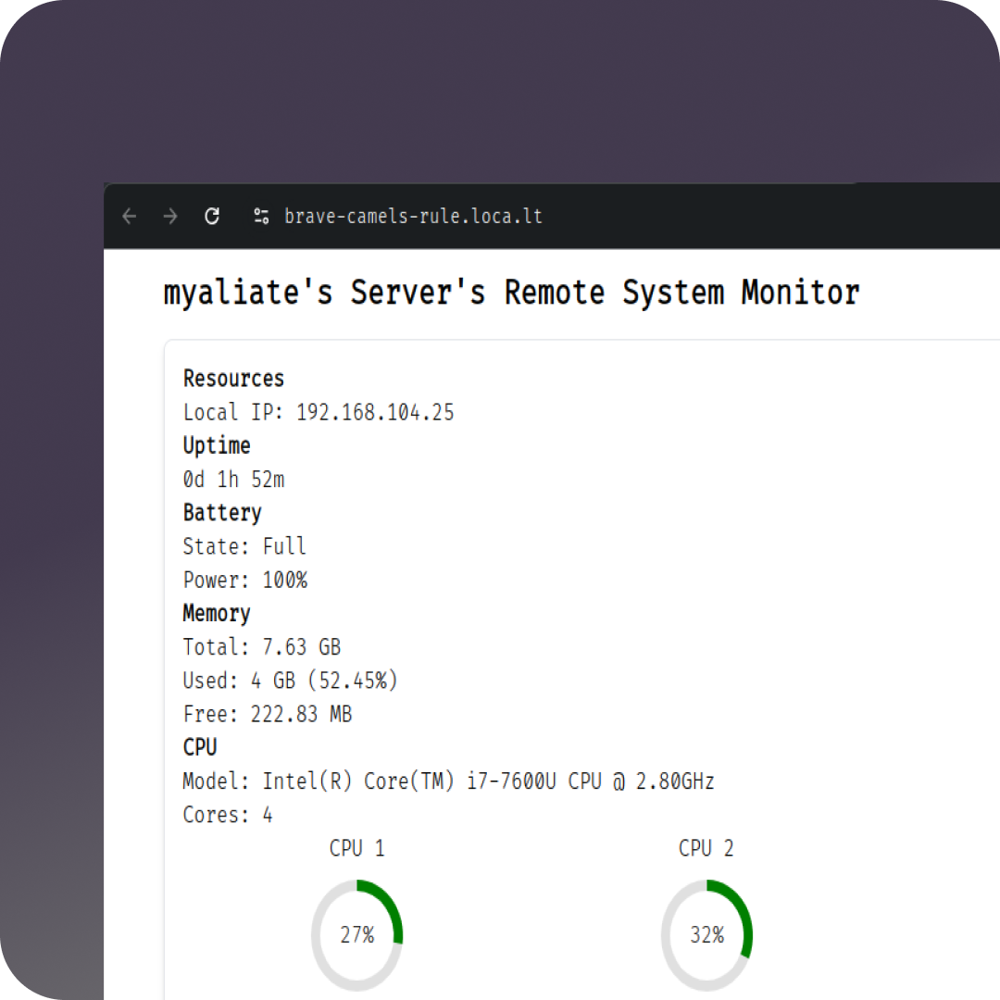

# ReSysTor: A Remote System Monitor

This is ReSysTor, a dead simple **RE**mote **SYS**tem moni**TOR**!



## Overview

ReSysTor is a lightweight, easy-to-use remote system monitoring tool designed to provide you with real-time insights into your system's performance.

## Features

- **Remote Monitoring:** Monitor your system from anywhere.
- **Simple Setup:** Get started with minimal configuration.
- **Real-time Data:** Receive up-to-the-minute information about your system’s performance.

## Getting Started

### Prerequisites

- Go 1.22 or later
- Node.js 18 or later

### Installation

1. Clone the repository:

   ```sh
   git clone https://github.com/Owbird/ReSysTor.git
   cd ReSysTor
   ```

2. Install dependencies:

   ```sh
   go mod download
   ```

3. Build the project:
   ```sh
   make build
   ```

### Configuration

ReSysTor can be configured using a `resystor.toml` file located in your user configuration directory. The configuration file allows you to customize various aspects of ReSysTor’s behavior.

Example configuration (`resystor.toml`):

```toml
name = "Hostname"
interval = 5 # Polling interval of 5s
```

### Running ReSysTor

To start monitoring, simply run:

```sh
./resystor
```

Access the local web interface at `http://localhost:3000`.

Access the remote web interface at the [Localtunnel](https://github.com/localtunnel/localtunnel) url generated.

## Contributing

We welcome contributions! Please fork the repository and create a pull request.

## License

This project is licensed under the MIT License. See the [LICENSE](LICENSE) file for details.
